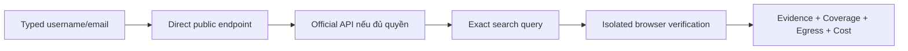

# SPIDER — kế hoạch tăng giá trị tìm kiếm username/email và chứng minh hiệu quả provider

Ngày lập: 04/09/2026. Trạng thái: **IMPLEMENTATION IN PROGRESS — chỉ fixture/offline, chưa chạy dữ liệu thật**.

## 1. Mục tiêu và giới hạn

Mục tiêu của đợt này là trả lời ba câu hỏi có thể đo được:

1. Với một username, SPIDER có tìm được đúng hồ sơ công khai trên Instagram, Threads, TikTok và các website liên quan không?
2. Với email do người dùng sở hữu hoặc được phép kiểm tra, SPIDER xác định được những dịch vụ nào có tín hiệu tài khoản mà không gửi thư, reset mật khẩu hoặc gây tác động đến tài khoản không?
3. Mỗi API key/provider có tạo ra dữ liệu hữu ích hay chỉ làm tăng độ phức tạp, thời gian và chi phí?

Không hứa “tìm hết Internet”. Tài khoản riêng tư, trang yêu cầu đăng nhập, CAPTCHA, nội dung không được index và API không cấp quyền phải được báo `UNKNOWN`, không suy thành `NOT_FOUND`. Trùng username hoặc email xuất hiện trên một trang không chứng minh cùng chủ sở hữu.

Giữ bốn nhãn: **FACT / HYPOTHESIS / EXPERIMENT RESULT / NOT YET VERIFIED**. Không dùng face recognition, profiling tâm lý, dữ liệu breach, credential stuffing, CAPTCHA bypass, proxy rotation hoặc tài khoản đăng nhập của người dùng để crawl.

### P0 — Phân loại input và typed identity

Phân loại phải dựa trên cú pháp có bằng chứng, không dựa vào việc chuỗi chứa dấu chấm. Thứ tự quyết định:

1. URL khi có scheme/URL intent hợp lệ; email khi toàn bộ chuỗi khớp email; IP khi parser IP chuẩn chấp nhận.
2. Domain chỉ khi hostname hợp lệ **và** suffix thuộc Public Suffix List được ghim phiên bản. DNS resolve chỉ là tín hiệu hỗ trợ, không tự đổi type.
3. Chuỗi còn lại hợp lệ theo quy tắc handle được nhận là `USERNAME`; vì vậy `ms.orianawren` phải mặc định là username, không phải domain.
4. Khi có hơn một cách hiểu hợp lệ, UI hiện type đang chọn và các lựa chọn thay thế trước khi egress; không tự chạy nhiều nhánh.

Định danh entity tối thiểu là `case_id + observable_type + namespace + canonical_value`. `DOMAIN:alice.dev` và `USERNAME:alice.dev` luôn là hai entity khác nhau. Mọi normalization phải giữ raw input để giải thích, có version và chỉ canonicalize trong đúng namespace; variant là derived candidate có lineage, không thay seed.

Mỗi investigation phải có `target_id` và `question_id`. Summary/finding chỉ được chiếu từ observation reachable qua lineage của target/question đó; entity khác trong cùng case không tự trở thành insight của seed đầu tiên. Đây là gate chống cross-contamination khi một case có nhiều username, email hoặc domain.

### Giá trị sản phẩm dành cho người Việt

SPIDER không được coi danh sách URL, DNS hoặc số lượng entity là “báo cáo hữu ích”. Màn hình kết quả phải trả lời bằng tiếng Việt phổ thông:

- **Đã tìm thấy gì?** Hồ sơ công khai, tín hiệu tài khoản, public mention hay chỉ hạ tầng email/domain.
- **Vì sao tin kết quả này?** URL canonical, tín hiệu phát hiện, nguồn, thời điểm, trạng thái canary và evidence liên quan.
- **Chưa biết điều gì?** Site chưa chạy, login wall, quyền API, rate-limit, parser drift hoặc budget.
- **Dữ liệu đã gửi đi đâu?** Search engine/provider nào đã nhận username/email và mục đích của request.
- **Người dùng nên làm gì tiếp?** Mở candidate để tự xác nhận, cấp quyền API phù hợp, chạy lại site bị rate-limit hoặc dừng vì không còn nguồn hợp lệ.

Ba use case ưu tiên là: tự kiểm tra dấu vết số của chính mình; phát hiện hồ sơ mạo danh/cùng username để người dùng tự đối chiếu; và kiểm tra hạ tầng domain/IP cho cá nhân/doanh nghiệp nhỏ. Không thiết kế luồng “tìm người đứng sau email” như một kết luận tự động.

Chuỗi tiếng Việt được chuẩn hóa Unicode NFC. Dấu tiếng Việt, `đ`, dấu chấm, gạch dưới và chữ hoa/thường phải được giữ trong seed. Biến thể bỏ dấu hoặc hoán đổi ký tự chỉ là query candidate do người dùng bật rõ ràng; không được tự merge entity hoặc làm bằng chứng cùng người.

### Hợp đồng finding có giá trị

Một finding chỉ được đưa vào phần tóm tắt khi giúp trả lời câu hỏi của case và có đường dẫn tới bằng chứng. Mỗi finding bắt buộc có: `claim_type`, thực thể được nói tới, trạng thái `FACT | HYPOTHESIS`, nguồn, thời điểm quan sát, độ mới, evidence ID, mức chắc chắn, contradiction và hành động tiếp theo. Số lượng URL/entity không được dùng thay cho giá trị điều tra.

Các claim ưu tiên cho personal discovery là:

- `CONFIRMED_PUBLIC_ACCOUNT`: profile tồn tại công khai trên một platform;
- `PUBLIC_CONTACT_OR_LINK`: website, email liên hệ hoặc liên kết khác do chính profile công khai;
- `PUBLIC_AFFILIATION`: tổ chức/dự án được profile hoặc nguồn chính thức tự công bố;
- `CROSS_PLATFORM_LINK`: một tài khoản công khai trỏ trực tiếp sang tài khoản khác;
- `POSSIBLE_MATCH`: candidate cần người dùng đối chiếu, không được trình bày như cùng người;
- `SERVICE_ACCOUNT_SIGNAL`: tín hiệu một email có thể có tài khoản tại dịch vụ đã audit;
- `INFRASTRUCTURE_CONTEXT`: DNS/domain/IP, tách khỏi danh tính cá nhân.

Không suy thuộc tính nhạy cảm, quan hệ riêng tư, vị trí hiện tại hoặc danh tính pháp lý từ username/email. `SAME_PERSON` chỉ được nâng thành fact khi có liên kết tự công bố/nguồn chính thức trực tiếp, hoặc người dùng xác nhận. Username giống nhau, display name, ảnh đại diện, bio, thành phố hay thời gian đăng tương tự chỉ là tín hiệu hỗ trợ; không tín hiệu nào trong số đó đứng riêng được phép merge entity. Contradiction phải hiển thị cạnh kết luận thay vì bị confidence score che mất.

### Chuẩn cho kết quả rỗng

Empty result phải nói rõ phạm vi đã kiểm tra thay vì “không tìm thấy gì”: số nguồn applicable, số đã quyết định, số bị chặn/unknown, site cụ thể chưa kiểm tra được, budget còn lại và lần kiểm tra. Kết luận chỉ được là “chưa có quan sát trong phạm vi này”; không được suy “không có tài khoản”. Bước tiếp theo chỉ xuất hiện khi có một nguồn chưa chạy có khả năng tăng coverage và phải nêu chi phí/egress trước khi người dùng chọn.

### Ba chế độ điều tra người dùng hiểu được

| Chế độ | Mục đích | Mặc định |
|---|---|---|
| **Quét nhanh dấu vết công khai** | Username/email: direct checks và official API có sẵn, ưu tiên Instagram/Threads/TikTok và nguồn precision cao. | Không browser, không biến thể suy đoán, không credit API hạ tầng. |
| **Đào sâu có kiểm soát** | Chạy exact search, audited email-service signals và browser verification cho những gap người dùng chọn. | Hiện trước destination, request/time/credit budget và yêu cầu consent cho egress mới. |
| **Kiểm tra hạ tầng Internet** | Domain/IP/organization với DNS/RDAP/CT/Shodan/Censys/FOFA. | Tách khỏi personal discovery để key hạ tầng không tạo cảm giác sẽ tìm tài khoản social. |

Không dùng một nút “điều tra mọi thứ” cho mọi observable. Trước khi chạy, UI phải cho biết dự kiến kiểm tra nhóm nguồn nào, nguồn nào không áp dụng, dữ liệu nào sẽ rời máy và giới hạn thời gian/request. Người dùng có thể dừng sau mỗi tầng mà vẫn nhận được bundle hợp lệ.

### Hợp đồng trải nghiệm của một run

1. **Trước khi chạy:** xác nhận target type, mục tiêu câu hỏi, scan mode, destination classes, budget và nguồn cần credential/entitlement.
2. **Đang chạy:** tiến trình theo source với `QUEUED | RUNNING | DECIDED | UNKNOWN | SKIPPED`; hiện time/request đã dùng và nút dừng sạch.
3. **Kết quả đầu:** ưu tiên finding/candidate có thể hành động; không bắt người dùng đọc graph hoặc DNS để hiểu có tìm thấy social profile hay không.
4. **Giải thích:** mở rộng evidence, provider receipt, contradiction, egress và raw technical detail khi cần.
5. **Bước tiếp theo:** chỉ đề xuất hành động có khả năng thay đổi coverage, kèm cost/risk; không đề xuất “chạy lại” chung chung.

## 2. Finding từ mã nguồn hiện tại

| Finding | Phân loại | Hệ quả |
|---|---|---|
| `USERNAME_DISCOVERY` hiện đi qua Maigret; catalogue bundled đã có Instagram, Threads và TikTok. | **FACT** | Không thể kết luận “thiếu provider”. Cần đo site có được chọn không, response là login wall/soft-404/rate-limit hay rule đã drift. |
| Username/email còn có `github_public`; email chủ yếu nhận DNS/mail-domain context và exact public GitHub match. | **FACT** | Hạ tầng Gmail không cho biết tài khoản bên thứ ba hay người đứng sau email. Kết quả hiện tại ít giá trị là phù hợp với coverage thực. |
| Uncover/Shodan/Censys/FOFA chỉ nhận domain, IP và organization. | **FACT** | Các key này không giúp trực tiếp cho `ms.orianawren` hoặc email cá nhân. UI hiện chưa giải thích phạm vi đủ rõ. |
| Uncover bridge `secure2` đã xuất journal allowlisted cho từng engine request và adapter đối chiếu journal với request/egress budget. | **EXPERIMENT RESULT** | Fixture đã bỏ trạng thái `UNMETERED_PROVIDER`; live key/search vẫn `NOT YET VERIFIED` nên chưa được quảng cáo là coverage Internet đã xác thực. |
| Playwright project-local đã tồn tại và dùng Chromium bundled. Playwright cảnh báo custom `executablePath` không được bảo đảm tương thích. | **FACT** | Cốc Cốc chỉ nên là POC tùy chọn; không được thay Chromium mặc định trước compatibility gate. |

## 3. Kiến trúc thu thập đề xuất

Mỗi target chạy theo tầng, từ bằng chứng ổn định và ít tốn kém đến phương án dễ drift hơn:

### Tầng 1 — Direct public profile checks

- Email exact có thể tra hồ sơ Gravatar công khai bằng SHA-256 của email đã trim/lowercase theo [hợp đồng hash](https://docs.gravatar.com/rest/hash/) và `GET /v3/profiles/{identifier}` theo [tài liệu profile](https://docs.gravatar.com/sdk/profiles/). Chỉ giữ schema allowlist; 404 chỉ là không có hồ sơ cho primary-email hash, không phải email/tài khoản khác không tồn tại.
- Audit riêng rule Instagram, Threads, TikTok trong Maigret: selection/ranking, URL canonical, redirect, locale, mobile/desktop response, login wall, soft-404, rate-limit và negative control.
- Kết quả chuẩn hóa: `CONFIRMED_PROFILE | CONFIRMED_NOT_FOUND | LOGIN_REQUIRED | RATE_LIMITED | BLOCKED | SOFT_404 | UNKNOWN | PARSER_DRIFT`.
- `CONFIRMED_PROFILE` cần ít nhất URL canonical và tín hiệu profile đặc hiệu đã qua canary. HTTP 200, title chung hoặc username xuất hiện trong HTML không đủ.
- Rule lỗi phải bị quarantine theo version; không làm cả investigation thất bại.

### Tầng 2 — Official API, có eligibility rõ

- **Threads:** đánh giá endpoint exact username `profile_lookup` và `profile_posts`; chỉ bật khi OAuth permission và app review thực tế đã PASS. Official collection yêu cầu username exact match.
- **Instagram:** Business Discovery chỉ phù hợp với Business/Creator; official Instagram API không bao phủ consumer account. Luồng này không được quảng cáo là tìm mọi tài khoản Instagram.
- **TikTok:** Display API chỉ đọc tài khoản đã OAuth cho app. Research API có username lookup nhưng đòi tổ chức/nghiên cứu đủ điều kiện và dự án được duyệt; không coi developer account thông thường là đủ quyền.
- API không có quyền phải hiện `NO_ENTITLEMENT`, không fallback âm thầm sang scraping.

Nguồn chính thức để review khi triển khai: [Meta Instagram API collection](https://www.postman.com/meta/instagram/documentation/6yqw8pt/instagram-api), [Meta Threads API collection](https://www.postman.com/meta/threads/documentation/dht3nzz/threads-api), [TikTok Display API](https://developers.tiktok.com/docs/en/display-api-get-started), [TikTok Research API eligibility](https://developers.tiktok.com/docs/en/research-api-faq).

### Tầng 3 — Search discovery có kiểm soát

- Query planner tạo tối đa vài truy vấn exact, ví dụ username quoted + `site:` theo platform; không sinh hàng trăm biến thể tên.
- Email search tách rõ `PUBLIC_EMAIL_MENTION` với `ACCOUNT_EXISTENCE`. Search result không được nâng thành xác nhận tài khoản.
- Mỗi query ghi Data Egress Ledger: search provider, loại identifier, direct/derived, thời điểm, số request và kết quả.
- Chỉ giữ URL/cached snippet cần thiết; loại query string/token và không lưu trang tìm kiếm thô quá retention.
- Trước khi dùng Cốc Cốc Search hoặc SERP khác phải review điều khoản, robots/rate-limit và khả năng dùng endpoint chính thức. Không parse SERP production trước gate này.

### Tầng 4 — Browser-assisted verification

Browser chỉ xác minh những candidate chưa quyết định được ở ba tầng trước; không mở một browser cho mọi website.

- Mặc định: Playwright + Chromium project-local, context mới cho mỗi run, profile tạm, không cookie/login/password extension, download hoặc clipboard.
- Cốc Cốc: adapter POC opt-in với executable được người dùng chọn; profile automation riêng, không dùng profile duyệt web mặc định. Cốc Cốc dựa trên Chromium, nhưng đó không phải bằng chứng Playwright tương thích đầy đủ; [Playwright cảnh báo custom executable không được bảo đảm](https://playwright.dev/docs/api/class-browsertype).
- Chế độ đầu tiên phải `headed` và hiện rõ website đang kiểm tra. Headless chỉ được cân nhắc sau khi fixture và TOS gate PASS.
- Không vượt login wall/CAPTCHA. Khi gặp challenge: dừng site đó, ghi `BLOCKED`, không retry vòng lặp.
- Giới hạn đồng thời theo domain, timeout/site, tổng page, RAM và tổng thời gian; đóng chính xác PID/browser context do SPIDER tạo.

## 4. Email account-existence theo consent

Không tồn tại API hợp pháp phổ quát để liệt kê mọi dịch vụ đã đăng ký bằng một email. Kế hoạch chia evidence thành ba loại không được trộn:

1. `PUBLIC_EMAIL_MENTION`: email xuất hiện công khai trong profile, commit, website hoặc archive.
2. `SERVICE_ACCOUNT_SIGNAL`: endpoint của một dịch vụ trả tín hiệu tồn tại/không tồn tại đặc hiệu, không gửi email hay thay đổi tài khoản.
3. `EMAIL_DOMAIN_CONTEXT`: MX/SPF/DMARC/domain; chỉ là hạ tầng.

Thử nghiệm Holehe/Socialscan chỉ dùng tập dịch vụ allowlist đã audit, email tự sở hữu/được ủy quyền và một request budget cố định. Loại bỏ module có thể gửi notification/reset, tạo account, vi phạm TOS hoặc không phân biệt soft failure. Mỗi dịch vụ có canary positive/negative do người dùng kiểm soát và trạng thái drift riêng.

Output: `CONFIRMED_EXISTS | CONFIRMED_NOT_EXISTS | RATE_LIMITED | LOGIN_WALL | BLOCKED | UNKNOWN | ERROR`. Không suy tên thật, số điện thoại, vị trí hoặc “người đứng sau email” từ account-existence.

## 5. Làm cho API key chứng minh được giá trị

### Provider Execution Receipt

Mỗi run phải hiển thị một receipt cho từng provider:

- `APPLICABLE | NOT_APPLICABLE` cho loại target;
- configured, account-validation state và search-entitlement state;
- `CALLED | SKIPPED | BLOCKED_UNMETERED | QUARANTINED`;
- request count, latency, quota/credit trước-sau nếu upstream cung cấp;
- query class đã dùng, không hiện raw identifier/credential;
- số observation/claim hữu ích và evidence IDs đóng góp;
- lý do không có kết quả hoặc không chạy.

Settings phải nói thẳng: “Shodan/Censys/FOFA dùng cho Internet assets (domain/IP/org), không dùng để tìm tài khoản social/email”. Trang case phải có câu “Key đã được dùng trong run này” hoặc “Không áp dụng/không được gọi”, không chỉ badge `VALID`.

### Uncover accounting gate

Không bỏ fail-closed. Chỉ mở lại Uncover trong investigation sau khi bridge xuất request journal có sequence, engine, destination, retry/page/control request, status và credit metadata; SPIDER đối chiếu journal với budget/egress ledger trước ingest. Nếu không chứng minh được request accounting, chuyển provider sang manual diagnostic và không quảng cáo là nguồn điều tra đang hoạt động.

Đánh giá Shodan/Censys/FOFA trên dataset domain/IP riêng. Shodan tài liệu hóa `host/count` là phép đếm không trả results và không dùng query credit; search có thể tiêu credit tùy filter/page. Censys Free chỉ có lookup host/web property/certificate, không có broad search. Vì vậy health check, entitlement check và real search phải là ba trạng thái khác nhau. Nguồn: [Shodan API](https://developer.shodan.io/api), [Censys Platform API](https://docs.censys.com/reference/get-started).

### Provider value gate

Sau tối thiểu 20 run consented/audited cho từng target class, provider chỉ giữ mặc định nếu có unique useful claims hoặc giảm request/time ở cùng decision coverage. Provider có 0 unique contribution, tỷ lệ lỗi cao hoặc cost/useful-claim vượt ngưỡng đăng ký trước sẽ bị tắt mặc định hoặc loại khỏi UI chính.

## 6. Tối ưu thuật toán tìm kiếm

Không dùng ML ngay. Giai đoạn đầu dùng planner xác định, có thể giải thích:

1. Lọc provider theo observable type, entitlement, health, policy và request accounting.
2. Chạy nguồn direct/official có precision cao trước.
3. Deduplicate candidate theo canonical URL + platform + username; cache positive dài hơn negative, nhưng invalidate theo provider version/canary drift.
4. Chỉ chạy search/browser khi coverage còn khoảng trống cụ thể.
5. Dừng khi hết budget, đủ câu trả lời, marginal yield thấp hoặc risk/cost vượt ngưỡng.

Mỗi bước lưu `expected_gain`, `actual_gain`, request, latency, credits, coverage delta và reason. Sau khi có tối thiểu 200 run audited và holdout riêng mới nghiên cứu scheduler thích nghi. Candidate đầu tiên là cost-sensitive ranking hoặc contextual bandit có constraint; không cho mô hình thay đổi truth label hay identity decision.

### Performance budget và SLO

Các số dưới đây phải đo trên benchmark machine được ghi trong manifest và với fixture/controlled network; live Internet report luôn kèm điều kiện mạng.

| Chỉ tiêu | Quét nhanh | Đào sâu |
|---|---|---|
| Time to first source outcome | p95 ≤5 giây | p95 ≤5 giây |
| Thời gian hoàn tất mục tiêu | p50 ≤20 giây, p95 ≤45 giây | p50 ≤90 giây, hard timeout ≤180 giây |
| Browser pages | 0 | Mặc định ≤3 unresolved candidates; tăng budget phải do người dùng chọn |
| Request | Preflight hiển thị cap; không vượt ledger budget | Cap riêng từng provider/domain; retry và redirect đều tính |
| API credit | 0 cho provider không áp dụng; không query hạ tầng trong personal mode | Hiện ước tính trước và số thực dùng sau run |
| Cleanup | 0 process/context/task rác sau success/cancel/failure | Cùng yêu cầu |

Nếu một official/direct request đang chậm, UI vẫn phải stream source outcome khác; không đợi tuần tự toàn bộ provider. Parallelism chỉ áp dụng giữa destination độc lập và vẫn tôn trọng per-domain concurrency/rate-limit. Cache không được che provider drift: positive và negative có TTL khác nhau, key gồm provider/parser version và scan question; cache hit phải hiện trong receipt.

## 7. Benchmark và acceptance criteria

Dataset phải gồm tài khoản do nhóm kiểm soát: positive, negative, private, deleted, login wall, soft-404, rate-limit, cùng username khác người, username có dấu chấm/gạch dưới và email đăng ký nhiều/ít dịch vụ. Train/tuning và holdout tách riêng; không dùng target người thật ngoài phạm vi đồng thuận.

| Gate | Acceptance |
|---|---|
| Username Meta/TikTok | Tất cả site được schedule hoặc có lý do skip; false positive và false merge trên holdout bằng 0; recall tăng ít nhất 20 điểm phần trăm so với baseline hiện tại ở cùng request budget. |
| Input classification | `ms.orianawren`, handle có dot/underscore/dấu, URL/email/IP/domain hợp lệ và chuỗi mơ hồ đều có fixture; 100% fixture chọn đúng type mặc định, UI cho đổi type trước egress; không merge entity khác namespace. |
| Email | Không gửi notification/reset và không thay đổi account; false positive ≤1%; incremental decision coverage tăng ≥20 điểm phần trăm trên audited services; unknown không bị tính âm tính. |
| Browser | 50 lượt fixture/platform, completion ≥98%, không đọc profile/cookie người dùng, không process rác, mọi egress/request được ledger ghi; Cốc Cốc không kém Chromium quá 2 điểm phần trăm trước khi được chọn. |
| API key | 100% run có receipt; configured/tested/called/contributed tách biệt; không credential trong UI/log/artifact. |
| Planner | Ở cùng false-positive gate: giảm ≥25% request hoặc tăng ≥20% decision coverage; p95 latency và credit/useful-claim không xấu hơn baseline đã đăng ký. |
| Product value | Ít nhất 70% test case có một kết luận hữu ích hoặc lý do unknown cụ thể; người dùng xác định được “đã kiểm tra đâu, dùng key nào, còn thiếu gì” trong usability test. |
| Identity safety | 0 auto-merge chỉ dựa vào username/display name/avatar/bio/location; 100% `SAME_PERSON` có evidence tự công bố/nguồn chính thức hoặc xác nhận người dùng; contradiction luôn được giữ. |
| Empty result | 100% case rỗng có coverage denominator, danh sách unknown/blocked, thời điểm và next step có điều kiện; không có câu khẳng định vắng mặt vượt quá phạm vi đã quan sát. |

Usability test dùng 8–12 người Việt không tham gia phát triển, với năm tác vụ: tìm hồ sơ exact username, phân biệt candidate với same-owner, hiểu một email empty result, xác định API key có được gọi, và đọc Data Egress Ledger. Gate: ≥90% phân biệt đúng `ACCOUNT_EXISTS` với `SAME_PERSON`; ≥80% hoàn thành từng tác vụ không cần người hướng dẫn; median ≤30 giây để chỉ ra vì sao provider bị skip. Nội dung kỹ thuật chi tiết vẫn có thể mở rộng, nhưng tóm tắt mặc định phải bằng tiếng Việt dễ hiểu.

### Quyết định GO / PIVOT / STOP

- **GO:** username/email experiment vượt quality, privacy, cost và usability gate; browser chỉ đóng góp ở các gap đã đo được.
- **PIVOT:** direct/official API tạo giá trị nhưng browser thường xuyên bị login wall/challenge; giữ SPIDER là evidence orchestrator và chuyển browser thành thao tác xác minh thủ công có hướng dẫn.
- **STOP nhánh personal discovery:** sau hai vòng canary/holdout vẫn không tăng ít nhất 20 điểm phần trăm decision coverage, hoặc false positive/notification/TOS gate thất bại. Không tiếp tục thêm tool để che một sản phẩm không tạo giá trị.
- **STOP Cốc Cốc automation:** challenge/login/manual-intervention vượt 10%, completion dưới 98%, cần profile thật, hoặc kết quả không tốt hơn Chromium/search API ở cùng budget.

### Traceability với ba yêu cầu đầu vào

| Yêu cầu | Phần xử lý | Bằng chứng bắt buộc |
|---|---|---|
| Username tìm Instagram/Threads/TikTok; email tìm tín hiệu dịch vụ; cân nhắc Cốc Cốc | Tầng 1–4, mục Email, V2–V5 | Per-site outcome, evidence URL, canary version, request/egress ledger, username/email holdout và browser compatibility report. |
| API key có hữu dụng và có được dùng không | Provider Execution Receipt, Uncover accounting gate, V1 | Mỗi run chỉ rõ applicable/configured/tested/called/contributed/credits; đối chiếu request journal với ledger. |
| Tối ưu thuật toán nếu tạo giá trị | Planner, provider value gate, V6–V7 | A/B cùng target/budget/health/cache; decision coverage, false positive, request, latency và credit/useful-claim. |

### Ma trận test tối thiểu trước khi triển khai production

| Nhóm | Fixture/holdout bắt buộc | Assertion chính |
|---|---|---|
| Social direct | claimed, unclaimed, private, deleted, soft-404, login wall, 429, localized response cho từng Meta/TikTok site | Không có 200→exists shortcut; mọi ca có outcome/reason; parser drift quarantine được. |
| Username identity | exact username cùng chủ; exact username khác chủ; variant bỏ dấu; dot/underscore; Unicode NFC/NFD | Candidate không tự thành `SAME_PERSON`; seed và variant không merge. |
| Input classifier | `ms.orianawren`, `alice.dev` dưới cả username/domain intent, IDN, invalid/unknown suffix, URL/email/IP và whitespace | PSL/versioned parser quyết định tái lập; ambiguous input hỏi một lần trước egress; typed identity không collision. |
| Question projection | case có nhiều seed và observation chéo, cùng canonical value nhưng khác namespace | Summary của từng target/question chỉ chứa lineage reachable; không lấy finding của seed khác làm insight. |
| Email service | controlled exists/not-exists, timeout, challenge, account notification detector | Zero notification/mutation; unknown không thành negative; từng service có budget/canary riêng. |
| Search discovery | exact query, no result, stale result, redirect, duplicate URL, unsafe scheme | Search chỉ tạo candidate/public mention; canonicalization và dedup đúng; query egress được ghi. |
| API key | valid/no entitlement/quota/rate/network/invalid; applicable và non-applicable target | Không gọi provider sai target; receipt phản ánh request thật; không lộ key/query thô. |
| Browser lifecycle | success, timeout, cancel, crash, challenge, user closes window | Không còn process/context rác; không dùng profile thật; challenge dừng đúng; PID chính xác. |
| Scheduler | static baseline và planner trên cùng snapshot provider health/cache | Không vượt request/entity budget; stop reason tái lập; quality không giảm để đổi lấy tốc độ. |
| Vietnamese UX | năm tác vụ usability đã định, light/dark, lỗi mạng, empty result | Nội dung tiếng Việt đúng nghĩa, không jargon đánh lừa; keyboard/accessibility cơ bản hoạt động. |

## 8. Thứ tự triển khai sau khi được duyệt

| Mốc | Ưu tiên | Deliverable | Gate ra |
|---|---|---|---|
| V0 | P0 | Input classifier, typed entity identity và target/question projection. | `ms.orianawren` đi vào username flow; không collision/cross-contamination trước khi chạy provider. |
| V1 | P0 | Provider applicability + execution receipt + UI giải thích key; audit `UNMETERED_PROVIDER`. | Không còn trường hợp UI nói key hữu dụng nhưng provider không chạy. |
| V2 | P0 | Canary/drift audit cho Instagram, Threads, TikTok trong Maigret; fixture và hard negatives. | Root cause từng platform được phân loại, không sửa bằng selector đoán. |
| V3 | P1 | Direct/official username acquisition; exact search discovery thử nghiệm. | Username benchmark đạt gate, TOS/permission PASS. |
| V4 | P1 | Email audited-service experiment với consent và zero-notification. | Email benchmark/privacy gate PASS. |
| V5 | P2 | BrowserAcquisition POC: Chromium trước, Cốc Cốc opt-in sau. | Compatibility, process, privacy, ledger và drift gate PASS. |
| V6 | P2 | Deterministic cost-aware planner, cache/stop policy và value dashboard. | Cùng quality nhưng ít request/cost hơn. |
| V7 | P3 | Adaptive scheduler experiment nếu đủ 200 audited run. | Holdout improvement có khoảng bất định; không tăng false merge. |

### Backlog theo review unit

Mỗi ticket dưới đây phải là một thay đổi nhỏ, có test riêng và có thể revert độc lập. Không gộp browser, provider mới và scheduler vào cùng một PR/commit.

| Ticket | Phạm vi mã dự kiến | Deliverable và gate |
|---|---|---|
| DV-01 — Applicability truth | `config/capabilities.yaml`, capability registry, provider `accepts()`, scheduler | Một hàm quyết định duy nhất trả applicable/reason. Contract test chứng minh email/username không gọi Uncover và domain/IP không gọi social provider. |
| DV-00 — Input/identity truth | classifier, canonicalizer, entity key và summary projection | Versioned PSL/parser; fixture ambiguity/Unicode; entity key đủ bốn trường; target/question lineage test chứng minh không collision hoặc cross-contamination. |
| DV-02 — Execution receipt model | `TaskRunRecord`/`ProviderRunRecord` metadata, request/egress ledger | Receipt có state machine hợp lệ; mỗi dispatch/outcome liên kết đúng task/run/provider; không lưu credential hoặc raw query. Ưu tiên metadata versioned, chỉ migration schema khi query/index requirement chứng minh cần thiết. |
| DV-03 — Receipt API/UI | case insights/API và giao diện nguồn dữ liệu | Người dùng thấy configured/tested/called/contributed/credits/reason. Browser test phủ applicable, skipped, blocked-unmetered, quota và useful contribution. |
| DV-04 — Uncover journal | private Go bridge, Uncover adapter, ProviderManager | Journal đếm từng engine request/retry/page; request count khớp ledger. Bridge crash/truncated journal phải fail-closed; sau gate mới cho phép investigation gọi Uncover. |
| DV-05 — Social diagnostics | Maigret worker/adapter, provider drift/canary | Diagnostic trả selection + final URL + response class + detection rule version cho Instagram/Threads/TikTok. Không lưu raw authenticated page; hard-negative không phát false profile. |
| DV-06 — Direct/official social experiment | capability definitions và adapter thử nghiệm tách theo platform | Threads/Instagram/TikTok có entitlement và outcome riêng. Không có quyền thành `NO_ENTITLEMENT`; không fallback ngầm. Chỉ register mặc định sau benchmark/TOS gate. |
| DV-07 — Exact search candidates | query planner, provider transport, egress/coverage | Bounded exact queries tạo `PUBLIC_MENTION`/candidate, không tạo same-owner. Dedup, stale result, redirect, rate-limit và query leakage có test. |
| DV-08 — Email service signals | adapter experiment tách biệt mail infrastructure | Module allowlist, zero-notification guard, per-service canary/budget/outcome. Không vendor/import upstream trước license compatibility review. |
| DV-09 — Browser acquisition POC | process supervisor + Playwright adapter, không nối trực tiếp vào resolver lúc đầu | Chromium fixture PASS trước; Cốc Cốc opt-in compatibility report sau. Browser chỉ trả candidate evidence envelope; resolver ingest sau security/TOS review. |
| DV-10 — Deterministic planner | scheduler/heuristics, coverage và provider health | Replay cùng snapshot cho cùng plan/stop reason; A/B baseline chứng minh quality/cost gate; feature flag cho rollback. |
| DV-11 — Benchmark và usability | benchmark protocol, synthetic/consented manifest, UI E2E | Machine-readable metrics + failure list + usability result; không dùng screenshot hay một target thành công làm release evidence. |

Thứ tự dependency bắt buộc: `DV-00 → DV-01 → DV-02 → DV-03 → DV-04`; `DV-05` có thể làm song song trên fixture nhưng `DV-06/07/08/09` chỉ nối vào engine sau DV-00–04. `DV-10` chỉ dùng dữ liệu từ các receipt đã audit. `DV-11` chạy ở từng mốc và là gate cuối, không phải việc dọn dẹp sau phát triển.

### Gate pháp lý, license và quyền truy cập

- Mỗi platform có một record review: endpoint/URL, purpose, dữ liệu gửi/nhận, authentication, rate-limit, retention, TOS/robots, region/eligibility, ngày kiểm tra và người phê duyệt.
- Holehe, Socialscan, WhatsMyName hoặc catalogue khác chỉ được benchmark ở commit ghim. Trước production phải quyết định rõ cơ chế tích hợp và nghĩa vụ license; không copy module/rule vào SPIDER vì tiện.
- Meta/TikTok official API phải có app permission/entitlement thực tế. “Endpoint tồn tại trong tài liệu” không được ghi là provider available.
- Search/browser path không được dùng session cá nhân. Nếu platform chỉ hoạt động khi đăng nhập, kết quả là `LOGIN_REQUIRED` và nhánh tự động dừng.
- Mọi thay đổi destination, query template, browser version hoặc detection rule làm invalid canary proof cũ và buộc review lại.

Release đầu tiên của nhánh này chỉ được gọi là hoàn thành khi V1–V4 và V6 đạt gate trên holdout độc lập. V5 không bắt buộc nếu direct/official/search đã đạt coverage; Cốc Cốc không được dùng để “đủ checklist”. V7 là tối ưu hậu nghiệm và không chặn release nếu deterministic planner đã đạt gate.

Artifact review bắt buộc cho mỗi mốc: experiment manifest, dataset hash không chứa identifier thô, phiên bản provider/parser/browser, pre-registered thresholds, machine-readable result, danh sách failure và quyết định `ADOPT | ITERATE | PIVOT | STOP`. Screenshot đẹp hoặc một case thành công không thay thế benchmark.

## 9. Quyết định hiện tại

- **ADOPT trên fixture:** provider execution receipt, applicability/preflight UI và Uncover request journal.
- **EXPERIMENT:** sửa coverage Meta/TikTok, email service signals, exact search discovery, deterministic cost-aware planner.
- **DEFER:** Cốc Cốc production, headless browser crawling và adaptive scheduler cho đến khi vượt gate.
- **REJECT:** dùng browser profile thật, đăng nhập tài khoản người dùng, bypass challenge, mass enumeration hoặc tuyên bố cùng danh tính chỉ từ username/email match.

### Trạng thái triển khai 05/09/2026

- **DV-00 PASS trên fixture:** `ms.orianawren` đi vào username flow; typed identity/projection không collision hoặc cross-contamination.
- **DV-01–03 PASS trên fixture:** preflight và execution receipt phân biệt applicable, scheduled, called, request count, contribution và credential state; request count tách theo target.
- **DV-04 PASS offline:** private runner `secure2` xuất journal allowlisted không URL/query/header/credential; Python xác thực journal, ghi credentialed egress và chặn trước engine vượt budget. Live Shodan/Censys/FOFA vẫn **NOT YET VERIFIED**.
- **DV-05 PASS trên fixture:** budget 50 ưu tiên Instagram/Threads/TikTok; login/rate-limit/challenge/parser drift trở thành unknown có lý do, không false negative. Live platform behavior vẫn **NOT YET VERIFIED**.
- **Email public-profile slice PASS offline:** Gravatar public v3 chạy trước GitHub search, chỉ gửi `EMAIL_SHA256`, ghi một anonymous egress, giữ trường profile allowlist và các verified-account link. 404/error/rate-limit không bị suy rộng; live target vẫn **NOT YET VERIFIED**.
- **Applicability fail-closed PASS:** scheduler và preflight cùng đối chiếu YAML với `accepts()` + `capabilities()`; cấu hình lệch không thể gọi provider sai observable. Email hiện loại SpiderFoot vì adapter không khai báo nhận email.
- **DV-06–11:** chưa hoàn thành. Email account-existence, exact search, browser/Cốc Cốc và adaptive optimization chưa được ADOPT.
