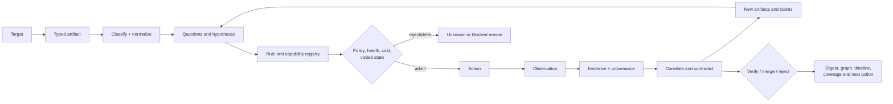
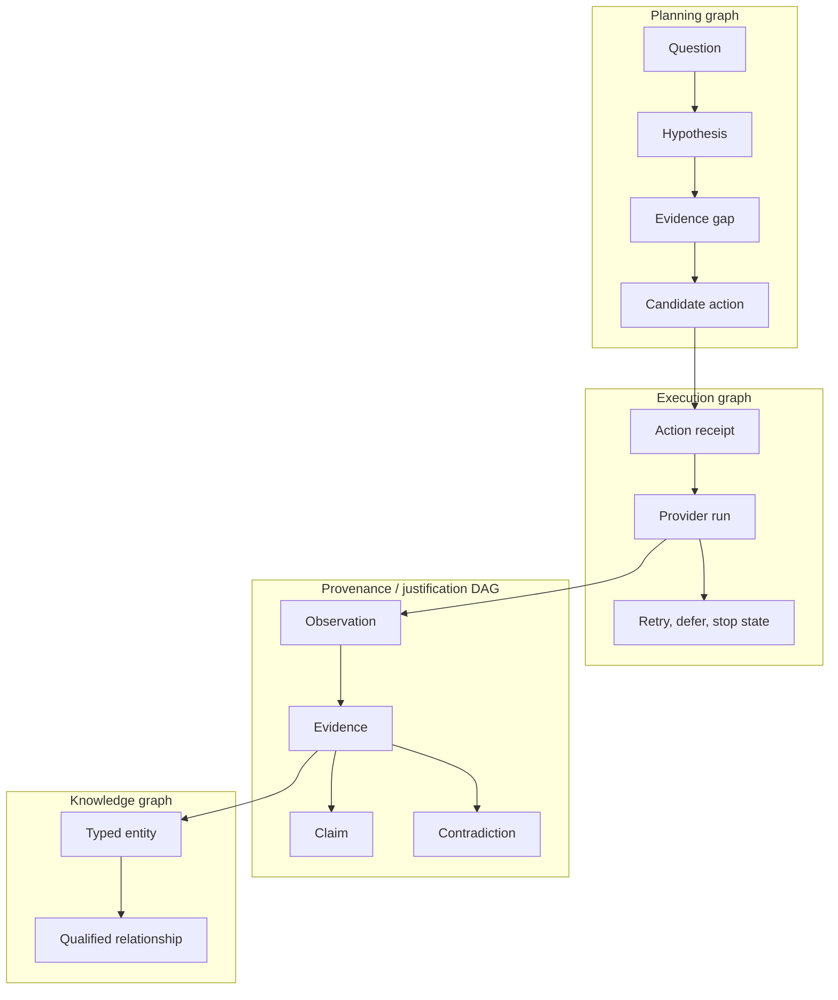
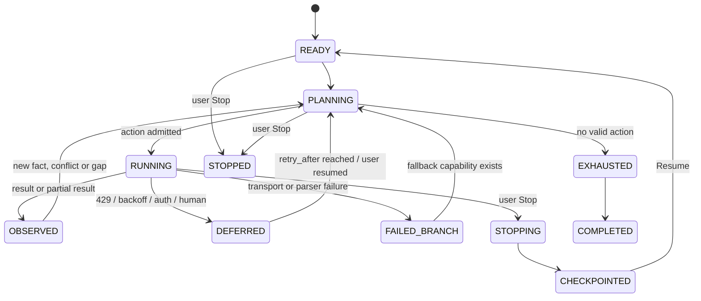
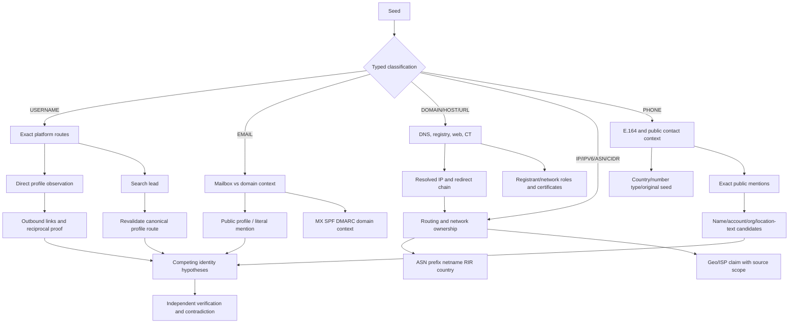

# SPIDER — Master plan cho Investigation Intelligence Engine

Trạng thái: **tài liệu kế hoạch duy nhất đang có hiệu lực**

Ngày audit: 10/09/2026

Baseline audit: `2ccf544116f7c30b15345a83c8cd4eb8d0e802c3`

Tài liệu này hợp nhất và thay thế các roadmap/plan trước đây. Các handoff, ADR,
báo cáo triển khai và báo cáo kiểm thử vẫn là lịch sử kỹ thuật, không phải kế
hoạch cạnh tranh. Mọi tuyên bố trong tài liệu dùng bốn nhãn:

- **FACT**: đã đối chiếu với source, config, dependency hoặc test hiện tại.
- **HYPOTHESIS**: hướng thiết kế cần benchmark để xác minh.
- **EXPERIMENT RESULT**: chỉ dùng khi có protocol và kết quả tái lập.
- **NOT YET VERIFIED**: chưa đủ bằng chứng thực tế để kết luận.

## 1. Đích sản phẩm

SPIDER phải trở thành một engine điều tra cục bộ, deterministic và evidence-first.
Nó tự chọn câu hỏi tiếp theo bằng luật có phiên bản, tự theo dõi trạng thái, có
thể pivot và quay lại nhánh cũ khi xuất hiện dữ kiện mới. Lõi không cần LLM ở
runtime. MCP vẫn cho phép một Agent bên ngoài đọc trạng thái, đề xuất giả thuyết
và yêu cầu capability; kiến trúc không cấm tích hợp AI trong tương lai.



Một investigation chỉ kết thúc khi frontier đã hết, không còn action hợp lệ,
người dùng bấm Stop, hoặc một giới hạn do người dùng chọn đã đạt. Failure của
một provider chỉ kết thúc nhánh tương ứng.

## 2. Audit codebase hiện tại

### 2.1 Thành phần giữ lại

| Thành phần | Trạng thái đã xác minh | Quyết định |
|---|---|---|
| Pydantic models và classifier | Có typed observable, canonicalization và explicit target type | Giữ, mở rộng contract |
| Capability Registry | `config/capabilities.yaml` ánh xạ input/capability/provider | Giữ làm điểm vào; thêm action/rule contract |
| Engine và scheduler | Có frontier, depth, deterministic ordering và batch concurrency | Refactor theo lát nhỏ; không rewrite |
| Provider adapters | Native DNS/RDAP/CT/Web, Maigret, SpiderFoot, Subfinder, Metabigor, Uncover, Cốc Cốc, WhatIsMyIP | Giữ adapter boundary; health fail-closed |
| Data plane | SQLite/WAL, append-only observation, single writer, raw artifact hash | Giữ; thêm durable frontier/checkpoint |
| Graph | Control, execution và knowledge graph đã được tách trong kiến trúc | Giữ; bổ sung justification/proof graph |
| Identity/projection | Typed identity và seed-reachable projection đã có test | Không làm lại; thêm question scope và guard |
| Accounting | Transport request ledger, task attribution, egress ledger và entity admission đã có | Giữ; sửa semantics unlimited và audit từng adapter |
| MCP | Có list/read, digest/delta, graph neighbors, run capability, hypothesis, coverage, compare, cancel | Giữ; thêm question/frontier/proof/plan API |
| Web UI | VI + light mặc định, classify/start/progress/report/evidence/graph, settings DPAPI | Giữ; chuyển UI thành investigation workspace |
| Browser | Playwright + Cốc Cốc persistent context, tab concurrency và trace đã có | Audit/repair correctness trước khi mở rộng |
| Test | Unit, integration, security, UI, E2E và fixture benchmark có sẵn | Giữ; thêm oracle/holdout/metamorphic |

### 2.2 Khoảng trống có bằng chứng

| Ưu tiên | Finding | Bằng chứng code hiện tại | Hậu quả |
|---|---|---|---|
| P0 | Username URL match bằng substring | `candidate_has_username()` trong `providers/browser/coccoc.py` | `alice` có thể khớp `/notalice/` |
| P0 | Route profile chưa được phân biệt chặt | URL bài TikTok có thể qua kiểm tra candidate | Post/video có thể bị trình bày như account |
| P0 | Access wall có thể bị coi là phủ định | Negative marker được xét trên body ngay cả với 403 | `BLOCKED` có thể thành `NOT_FOUND` |
| P0 | Search candidate có thể ghi đè direct signal | Indexed candidate merge theo platform | Bằng chứng yếu che lý do direct mạnh hơn |
| P0 | Email search dễ dính query echo | Literal email được tìm trong cả trang kết quả | SERP có thể tự xác nhận chính query của nó |
| P0 | Connectivity preflight phụ thuộc một host | Browser preflight hiện dùng `example.com` | Một host lỗi có thể chặn sai nhiều nhánh độc lập |
| P1 | Scheduler dùng cost/yield tĩnh | `scheduler/heuristics.py` là bảng hằng | Chưa biết action nào tăng tri thức thực tế |
| P1 | Next action quá thô | `coverage.py` và `digest.py` chỉ có vài action cố định | Chưa có planning loop theo question/gap |
| P1 | Hypothesis chưa do engine xây dựng | `service/hypothesis.py` lưu statement caller gửi | Chưa có luật sinh/cạnh tranh giả thuyết |
| P1 | Quan hệ dựa nhiều vào type pair | `resolution/rules.py` ánh xạ loại đầu-cuối | Dễ nâng association thành identity candidate quá sớm |
| P1 | Temporal comparison thiếu eligibility | So field giữa observation cùng identity mà chưa đủ source/completeness guard | Provider disagreement có thể thành change giả |
| P1 | Benchmark manual chưa được thực hiện | Test tạo 100 dòng synthetic để kiểm scorer | Chưa chứng minh bằng hoặc hơn điều tra thủ công |
| P1 | Browser live/session hiệu quả chưa được benchmark | Fixture trace có; holdout live chưa có | Không được tuyên bố tự động hóa đáng tin cậy |

Các probe logic tổng hợp ở baseline tái hiện được các lỗi substring, post-as-profile,
403-as-negative và indexed-overwrite. Đây là **EXPERIMENT RESULT trên hàm/fixture**,
không phải kiểm thử Internet thực.

## 3. Bốn graph, một source of truth



- **Planning graph** có thể quay lại node cũ, nhưng mỗi state có fingerprint và
  transition guard để không lặp vô hạn.
- **Execution graph** là lịch sử hành động, retry, health, budget và kết quả.
- **Justification DAG** cho biết claim dựa trên evidence/rule/assumption nào.
  Mirror hoặc derived evidence không được đếm thành nguồn độc lập.
- **Knowledge graph** mô tả các thực thể và quan hệ ngoài đời; không dùng nó làm
  hàng đợi thực thi.

Source of truth vẫn là observation log + action receipt. Entity, assertion,
digest, coverage và confidence đều là projection có thể rebuild.

## 4. Contract của bộ não deterministic

### 4.1 Artifact identity

Khóa tối thiểu:

`case_id + observable_type + namespace + canonical_value`

`DOMAIN:alice.dev` không bao giờ merge với `USERNAME:alice.dev`. ACCOUNT bắt buộc
có namespace platform. Raw input được giữ làm seed evidence/context nhưng không
được tính là finding mới.

Mọi artifact còn có `discovered_from_observation_id`, `seed_id`, `question_id`,
`first_seen`, `last_seen`, `scope`, `sensitivity`, `review_state`.

### 4.2 Rule schema

Mỗi rule là dữ liệu versioned, được validate khi khởi động:

```text
id, version, question_type, input_types, namespace_guard, preconditions,
required_capability, action_template, expected_observations, output_artifacts,
claim_template, evidence_requirements, contradiction_rules, confidence_effect,
next_pivots, fallbacks, cost_class, rate_limit_policy, retry_policy,
loop_key, exhaustion_key, stop_condition, explanation_key
```

Không viết cây `if provider A lỗi thì provider B` xuyên suốt code. Rule yêu cầu
capability; registry chọn action/provider thỏa capability, policy, health và
evidence gap.

### 4.3 Claim lifecycle

`PROPOSED → SUPPORTED | CONFLICTED | REJECTED | SUPERSEDED`

Nhãn trình bày cho người dùng:

`FACT | OBSERVATION | DERIVED_FACT | HYPOTHESIS | CONFLICT | UNKNOWN | BLOCKED`

`NOT_OBSERVED`, `TIMEOUT`, `403`, `CAPTCHA`, parser error hoặc provider failure
không bao giờ tự chuyển thành `DOES_NOT_EXIST`.

### 4.4 Giải thích confidence

Không xuất một số phần trăm tùy ý. Engine xếp evidence theo vector có thể đọc:

1. tính trực tiếp;
2. mức khớp typed/namespace/route/field;
3. độc lập nguồn;
4. độ mới và khoảng thời gian hiệu lực;
5. số contradiction chưa giải quyết;
6. parser/provider health tại thời điểm thu thập;
7. review state.

UI hiển thị `STRONG / MODERATE / WEAK / CONFLICTED / INSUFFICIENT` cùng lý do.
Chỉ sau benchmark calibration mới cân nhắc probability.

## 5. Vòng điều tra và chế độ tài nguyên



| Chế độ | Time budget | Request budget | Cách chọn nhánh |
|---|---:|---:|---|
| FAST | hữu hạn | hữu hạn | direct/high-yield trước, dừng khi đủ answer hoặc hết budget |
| DEEP | hữu hạn lớn | hữu hạn lớn | nhiều verification/fallback/pivot hơn |
| UNBOUNDED | `null` | `null` | không deadline/quota nhân tạo; chạy đến Stop hoặc frontier exhausted |

Time và request là hai lựa chọn độc lập. `null` nghĩa SPIDER không tự áp trần
tổng. Nó không vô hiệu hóa rate limit, quota upstream, per-action timeout,
backoff, policy, cancellation, concurrency, dedup hay loop detection. Entity và
depth guard hiện còn là giới hạn cấu trúc; phải chuyển dần sang branch exhaustion
và visited-state trước khi gọi toàn bộ workflow là UNBOUNDED hoàn chỉnh.

Checkpoint tối thiểu chứa frontier, visited fingerprints, deferred actions,
provider health snapshot, rule/config version, ledger và last committed
observation. Resume không replay action có receipt bất định nếu người dùng chưa
chọn retry.

## 6. Đại đồ thị tư duy theo loại đầu vào



### 6.1 USERNAME / ACCOUNT

1. Parse exact canonical handle and platform namespace if present.
2. Direct route rules validate host, allowed profile path and exact decoded path
   segment; reject post/video/story/search routes.
3. Classify response in order: network/auth/rate-limit/block first, then
   platform-specific positive/negative markers.
4. Search results are `SEARCH_LEAD`; query echo, ads, snippets and unrelated
   same-substring URLs are not account evidence.
5. Fetch/revalidate a lead before creating ACCOUNT observation when access and
   policy allow. Keep both direct and search observations; never overwrite.
6. Extract public outbound profile links, `rel=me`, top-level JSON-LD `sameAs`
   and reciprocal links with provenance.
7. Same handle, avatar, bio or name creates a hypothesis only. No personality,
   ethnicity, religion, health, sexuality or other sensitive inference.

P0 regression set includes `alice` vs `notalice`, TikTok post vs profile,
generic shell, login wall containing negative text, redirect to login, expired
alias, wildcard soft-404, query echo and duplicate/mirror search results.

### 6.2 EMAIL

Tách ba câu hỏi:

- mailbox xuất hiện công khai ở đâu;
- dịch vụ nào có tín hiệu account-existence hợp lệ;
- domain email có hạ tầng gì.

Public mention, Gravatar/GitHub profile và service-existence là evidence khác
loại. MX/SPF/DMARC không cho biết người đứng sau email. Không SMTP probing,
password reset, OTP, breach/credential dump hoặc suy tên/ngày sinh. Canonical
transform cho Gmail dot/plus/case chỉ được áp dụng theo provider-specific rule có
test; không dùng blanket normalization.

Holehe/Socialscan chỉ ADOPT sau benchmark hai tập: OVERLAP để so accuracy và
HOLEHE-ONLY audited set để đo incremental coverage, kèm license/TOS/drift gate.

### 6.3 DOMAIN / HOST / URL

Các câu hỏi đầu ra:

- DNS hiện tại: A/AAAA/CNAME/MX/NS/TXT/SOA và chain;
- RDAP: registrar, trạng thái, dates và contact role được phép công khai;
- CT: certificate name đã quan sát, không mặc định là host đang hoạt động;
- Web: HTTPS status, redirect, title, headers và technology hint;
- IP → ASN/prefix/netname/organization và dấu hiệu CDN/edge;
- mail sender controls, DNSSEC và archive/temporal observations.

ASN/RDAP country, IP geolocation, organization office và CDN edge không chứng
minh vị trí máy chủ vật lý. “Data center” chỉ là sourced claim khi provider công
bố facility/region và observation gắn đúng resource/time. External scan cũ không
chứng minh port/CVE hiện tại. Thiếu archive là `NO_ARCHIVED_OBSERVATION`, không
phải `DISAPPEARED`.

URL input phải qua SSRF guard: scheme/host allow rules, DNS resolution và
redirect revalidation, private/link-local/loopback block, size/content-type cap.

### 6.4 IP / IPv6 / ASN / CIDR

1. Phân loại routable/private/reserved trước egress; private chỉ local analysis.
2. RDAP + BGP/routing + reverse DNS + sourced geo/ISP/proxy claims.
3. Tách network registrant, announced-by ASN, service operator, CDN edge và
   hosting/facility claim.
4. CIDR chỉ aggregate/prefix analysis; không tự enumerate toàn dải.
5. API key phải có receipt chỉ ra capability nào đã dùng, request/credit và
   useful evidence nào tạo ra. Auth valid không đồng nghĩa có entitlement search.

### 6.5 PHONE

1. Giữ raw seed; chuẩn hóa số Việt Nam sang E.164 `+84...`.
2. Ghi country code, number type và original carrier hint; MNP khiến current
   carrier là UNKNOWN nếu không có nguồn hiện hành.
3. Exact public mention search trên nguồn phổ biến tại Việt Nam tạo candidate:
   `PHONE↔NAME/ACCOUNT/ORGANIZATION/URL/LOCATION_TEXT`.
4. Phân loại `PUBLIC_SELF_PUBLISHED`, `THIRD_PARTY_MENTION`,
   `BUSINESS_CONTACT`, `DIRECTORY_ENTRY`, `SEARCH_SNIPPET`, `USER_CONFIRMED`.
5. Mirror cluster không tăng độc lập. Nhiều tên, số tái sử dụng, SIM đổi chủ,
   business/shared number và dữ liệu cũ là hypotheses cạnh tranh.
6. UI hỏi “Ai/đơn vị nào có bằng chứng công khai liên quan?” và xếp theo quality,
   recency, source independence với lý do; không có trường “chủ sở hữu”.

Không gọi thử, SMS/OTP, contact discovery tương tác, breach hoặc suy đoán từ dump.

### 6.6 ORGANIZATION và artifact mới

Organization phải được disambiguate bằng tên pháp lý, namespace registry, official
domain hoặc public identifier. Keyword match chỉ là lead. Artifact mới chỉ vào
frontier khi có observation ID, rule ID, question/seed scope và policy decision.

## 7. Browser Operator Cốc Cốc

Hai mode chính thức:

- `DEDICATED_PROFILE`: profile riêng do SPIDER quản lý; mặc định cho automation.
- `ATTACH_EXISTING_BROWSER`: chỉ khi người dùng chủ động chọn; attach qua cơ chế
  tương thích đã được kiểm tra trên đúng executable/version.

Playwright hỗ trợ persistent context và Chromium CDP, nhưng tài liệu chính thức
cảnh báo attach CDP có fidelity thấp hơn và profile/browser arguments không tương
thích có thể làm chức năng hỏng. Vì vậy Cốc Cốc phải có compatibility probe theo
version; không giả định mọi hành vi giống Chrome.

Browser action primitives: launch/attach, tab lease, navigate, search, click,
scroll, wait DOM, read rendered content, follow link, fill normal search form,
observe redirect, extract artifact, snapshot/screenshot có chọn lọc và download
công khai được phép. Mỗi step có action ID, parent observation, sanitized URL,
timestamp, source, outcome và content hash khi phù hợp.

CAPTCHA/WAF/403/429/login wall trở thành `HUMAN_REQUIRED`, `BLOCKED`,
`RATE_LIMITED` hoặc `AUTH_REQUIRED`; không thiết kế bypass. Partial evidence luôn
được commit trước khi nhánh defer. Preflight chẩn đoán từng origin, không dùng lỗi
một website để tuyên bố toàn bộ Internet hỏng.

## 8. Planner, scheduling và provider health

### 8.1 Question-driven planner

Mỗi seed tạo question templates. Planner tính evidence gap rồi sinh candidate
action. Candidate được lọc theo:

`scope → policy → capability → provider health → visited → dependency → budget → concurrency`

Ranking ban đầu deterministic theo tuple, không ML:

`required_verification, directness, new_question_coverage, reliability_band,
estimated_requests, latency_band, stable_tiebreaker`

Telemetry chỉ được đưa vào sau khi request ledger đáng tin và đủ mẫu. Khi đó so
static với adaptive bằng useful evidence/request, decision coverage, p50/p95,
429/error và false attribution. Không nghiên cứu cost-aware scheduler trước gate
accounting.

### 8.2 Provider state machine

`UNVERIFIED → HEALTHY → DEGRADED → RATE_LIMITED/AUTH_REQUIRED/HUMAN_REQUIRED/BLOCKED/ERROR`

`live_verified` và `contract_verified` mặc định false. Một state chỉ được nâng
sau đúng probe; token hợp lệ, entitlement, quota và search result là các bằng
chứng riêng. Retry theo reason code, có max attempt cho cùng action state và
`retry_after`; unlimited investigation không retry nóng.

## 9. Data, API, MCP và UI đích

### 9.1 Storage bổ sung

- `questions`, `hypotheses`, `claim_evidence`, `investigation_frontier`;
- `action_receipts`, `provider_health_events`, `rule_versions`;
- temporal validity (`observed_at`, `published_at`, `valid_from/to`, precision);
- evidence dependency/mirror cluster;
- durable checkpoint và resume cursor.

Migration additive, rebuildable và rollback bằng feature flag. Credential vẫn ở
Windows DPAPI vault; plaintext không vào settings, DB, log, HTTP, report hay test
artifact.

### 9.2 Investigation API/MCP

Các API cần hoàn thiện:

- case digest/delta theo target + question;
- list/create/resolve question và competing hypotheses;
- list frontier, candidate actions và lý do rank/reject/defer;
- run action/capability với idempotency receipt;
- action status, per-run Stop, checkpoint, resume;
- graph pivot, proof path, contradictions và temporal history;
- coverage/unknown, provider health, egress ledger, compare runs;
- plan preview không dispatch và compact state cho Agent.

Response mặc định compact, paginated, allowlist field và không raw graph khổng
lồ. Dữ liệu nguồn là untrusted content, không phải instruction cho Agent.

### 9.3 Investigation workspace

Luồng UI:

`case → question → current answer → evidence/conflict → graph/timeline → pivot → coverage`

Người dùng luôn thấy: đang chạy bước gì, tại sao chọn, gửi dữ liệu gì tới đâu,
đã biết gì, còn thiếu gì, source nào blocked và action tiếp theo. Findings không
hiển thị seed/user-input như phát hiện. UNBOUNDED có nhãn rõ, request/time đã dùng,
nút Stop theo run và trạng thái checkpoint/resume.

Ngôn ngữ báo cáo giải thích suy luận bằng câu thân thiện, nhưng không làm mềm
độ bất định: “đã quan sát”, “đây là ứng viên”, “chưa đủ để gán danh tính”, “nguồn
không trả lời” và “không có bằng chứng” là các câu khác nhau.

## 10. Security, policy và data egress

- Global Host allowlist; Origin/Sec-Fetch cho thao tác nhạy cảm; HTTP và WebSocket
  đều fail-closed trước xử lý body/session.
- Egress ledger ghi fingerprint, identifier class, destination, purpose, time,
  direct/derived, credentialed/anonymous và outcome; không ghi secret/plaintext.
- UI phân biệt local-only với dữ liệu gửi bên thứ ba.
- Không bypass CAPTCHA/rate limit/WAF, không session/cookie theft, credential
  harvesting, intrusion, mass contact discovery hoặc profiling thuộc tính nhạy cảm.
- Browser profile riêng là mặc định. Profile cá nhân chỉ attach khi user chọn và
  chỉ SPIDER-owned tabs/actions được đóng.
- Không thêm provider chỉ để tăng số lượng. License, TOS, stability, value và
  maintenance cost phải PASS trước ADOPT.

## 11. Test và benchmark bắt buộc

### 11.1 Test pyramid

| Lớp | Nội dung |
|---|---|
| Unit/property | normalization, route matcher, rule guards, state transition, ranking, dedup, cycle fingerprint |
| Contract | provider output/status/provenance, auth/quota/rate/parser drift, secret redaction |
| Integration | planner→action→observation→claim→pivot, budget nullable, checkpoint/resume/Stop |
| Security | hostile Host/Origin/WS, SSRF/redirect, DPAPI, log/HTTP/artifact redaction |
| Browser fixture | direct profile, post route, login wall, soft-404, query echo, three-tab isolation |
| E2E local | launch→classify→question→run progress→summary→sources→evidence→graph→Stop/resume |
| Realistic smoke | chỉ target kiểm soát/được phép, không credential in output, có cleanup |

Metamorphic invariants: đảo thứ tự provider không đổi claim; thêm mirror không
tăng strength; duplicate artifact không tăng entity; contradiction không biến
mất; timeout/provider failure không thành negative; resume không double-dispatch;
seed khác không cross-contaminate; unlimited vẫn không lặp action state.

### 11.2 Benchmark thủ công

Không được dùng 100 dòng synthetic để tuyên bố bằng con người. Protocol phải:

- stratify theo seed type, platform/source và hard-negative class;
- truth adjudication mù với output engine;
- identity/site/time holdout để tránh leakage;
- ghi request, elapsed, actions, final evidence và undecided;
- báo precision/recall/false-attribution/decision coverage với confidence interval;
- so paired manual vs SPIDER trên cùng nguồn, quyền truy cập, thời điểm và câu hỏi;
- đo wall-clock, physical requests, useful evidence/request, graph/API/UI latency;
- dùng ít nhất 100 cặp case-site với tối thiểu 30 positive/30 negative cho pilot,
  sau đó tính sample size theo interval/power trước claim release.

Gate sản phẩm: precision và recall không thấp hơn manual trong interval đã chốt,
false attribution không tăng, decision coverage không thấp hơn và median time
không cao hơn. Nếu chưa đạt, ghi NOT YET VERIFIED và công bố failure strata.

## 12. Kế hoạch migration có gate

### Phase P0-A — Correctness trước độ sâu

- **Goal:** sửa exact username/profile route, access-wall precedence, query echo,
  evidence merge và origin-specific failure.
- **Files:** browser adapter/classifier, observation merge, coverage reason mapping.
- **Tests:** regression cases ở 6.1; không live target.
- **Acceptance:** mọi negative chỉ do platform-specific verified marker trên
  response hợp lệ; direct evidence không bị search lead ghi đè.
- **Performance:** route/parser p95 không tăng đáng kể trên fixture.
- **Rollback:** feature flag parser/rule version và giữ observation cũ rebuildable.

### Phase P0-B — Budget, Stop và durable progress

- **Goal:** time/request limited hoặc unlimited độc lập; per-run Stop, checkpoint,
  resume, visited state và branch exhaustion.
- **Files:** budget models, engine loop, run/action schema/repository, API/MCP/UI.
- **Tests:** null budgets, quota/429, cancellation mọi await boundary, crash/resume,
  cyclic graph và deterministic replay.
- **Acceptance:** unlimited không dừng do request/deadline nhân tạo; không hot-loop;
  Stop giữ committed evidence và run thành CANCELLED/CHECKPOINTED.
- **Resource:** bounded concurrency/backpressure và per-action timeout luôn còn.
- **Rollback:** nullable fields additive; finite mode giữ hành vi cũ.

### Phase P0-C — Rule registry và proof contract

- **Goal:** versioned rules, questions/gaps, claim lifecycle, justification DAG.
- **Files:** `reasoning/`, models/schema, projection, resolver, explain/report.
- **Tests:** schema validation, conflicting rules, mirror, stale evidence, rebuild.
- **Acceptance:** mọi candidate action/claim giải thích được rule + evidence + scope;
  engine tái hiện cùng plan từ cùng snapshot.
- **Rollback:** feature flag planner v2, observation log không đổi.

### Phase P1-A — Vertical slice USERNAME

- **Goal:** một vòng hoàn chỉnh exact direct→search lead→revalidate→link proof→
  competing hypothesis→next action.
- **Tests:** local seven-site fixtures, hard negatives, parser drift, 3-tab timing,
  user Stop và partial.
- **Acceptance:** zero known false account promotion trong regression; no claim
  manual superiority trước holdout.
- **Rollback:** capability-level disable; legacy provider results vẫn đọc được.

### Phase P1-B — EMAIL, DOMAIN, IP

- **Goal:** question templates và sourced claims riêng cho mailbox/domain,
  infrastructure roles, CDN/origin/facility uncertainty.
- **Tests:** empty result, DNS partial, RDAP roles, CT stale, SSRF/redirect, IPv6,
  private address, entitlement/quota and replay.
- **Acceptance:** report trả lời câu hỏi người dùng, không lẫn hạ tầng với người;
  data-center claim luôn có source/scope/time hoặc UNKNOWN.

### Phase P1-C — PHONE và input còn lại

- **Goal:** E.164, public candidates, temporal/mirror/contradiction; audit URL,
  CIDR, ACCOUNT, ORGANIZATION first-class.
- **Acceptance:** unsupported type bị disable rõ; supported type có provider,
  question, evidence output và E2E. PHONE không tạo owner field.

### Phase P1-D — Adaptive scheduling và provider value

- **Prerequisite:** physical request/entity ledger và reliable health PASS.
- **Goal:** telemetry p50/p95/cost/useful evidence/error/429, static vs adaptive A/B.
- **Acceptance:** holdout cải thiện time/cost ở cùng correctness hoặc tăng decision
  coverage không tăng false attribution. Không đạt thì giữ static.

### Phase P1-E — UI/MCP investigation workbench

- **Goal:** compact digest, frontier/plan preview, graph pivot, proof and temporal
  views, egress, Stop/resume.
- **Acceptance:** critical E2E VI/light + empty explanation; Agent hoàn thành một
  multi-pivot case mà không tải raw graph hoặc đọc lại toàn bộ history.

### Phase P2 — Source research có chọn lọc

Holehe/Socialscan/WhatsMyName/archive/urlscan hoặc nguồn VN chỉ vào experiment
sau license/TOS/drift/holdout. ADOPT khi tạo artifact, verification, pivot hoặc
temporal context mới với value vượt maintenance/risk. Không source-count KPI.

## 13. Definition of Done cho từng phase

Mỗi phase phải ghi:

1. goal và câu hỏi điều tra được cải thiện;
2. files/components changed và architectural impact;
3. unit/contract/integration/security/UI/E2E phù hợp;
4. acceptance và regression gate;
5. performance/resource result;
6. failure cases và phần UNKNOWN;
7. rollback/feature flag;
8. benchmark trước/sau nếu tuyên bố cải thiện;
9. commit nhỏ, reviewable; không gộp provider/framework ngoài scope;
10. update master status và handoff lịch sử.

## 14. Trạng thái thực thi tại thời điểm audit

| Hạng mục | Trạng thái |
|---|---|
| Inventory/architecture/gap audit | **FACT — hoàn thành cho source/config/tests/docs liên quan; vendor/generated code không review thủ công** |
| Hợp nhất plan | **FACT — tài liệu này là master duy nhất** |
| Nullable time/request budget | **EXPERIMENT RESULT — implementation và full suite 471 tests PASS ngày 10/09/2026** |
| P0-A browser correctness | **EXPERIMENT RESULT — exact route/access precedence/query-echo/merge/preflight regressions PASS trên fixture; Cốc Cốc live version matrix chưa kiểm chứng** |
| P0-B budget/Stop/checkpoint/resume | **EXPERIMENT RESULT — fixture PASS: nullable totals, bounded samples, per-run Stop, versioned frontier, crash recovery, no automatic replay và resume qua UI/API/MCP; live long-run crash chưa kiểm chứng** |
| Rule registry/planning/proof graph | **NOT YET VERIFIED** |
| Username vertical slice v2 | **NOT YET VERIFIED** |
| Email/domain/IP/phone reasoning v2 | **NOT YET VERIFIED** |
| Manual parity benchmark | **NOT YET VERIFIED** |

## 15. Nguồn thiết kế chính

- [W3C PROV overview](https://www.w3.org/TR/prov-overview/): provenance,
  derivation, versioning và reproducibility; dùng làm vocabulary inspiration,
  không bắt buộc RDF/OWL.
- [Doyle, A Truth Maintenance System](https://doi.org/10.1016/0004-3702(79)90008-0):
  support/assumption/contradiction inspiration; không nhập nguyên framework.
- [SHOP HTN planning, University of Maryland](https://www.cs.umd.edu/projects/shop/description.html):
  task decomposition và method preconditions; dùng cho rule planner nhỏ,
  không thêm planning runtime.
- [Playwright BrowserType](https://playwright.dev/python/docs/api/class-browsertype):
  persistent context, connect và CDP limitations.
- [Bucinca et al., CHI 2021](https://www.eecs.harvard.edu/~kgajos/papers/2021/bucinca2021trust.shtml):
  cognitive forcing giảm overreliance trong nghiên cứu người dùng; áp dụng thử
  cho UI conflict/review, hiệu quả trong SPIDER vẫn NOT YET VERIFIED.

## 16. Nội dung kế hoạch cũ đã hợp nhất

Typed identity, request/entity accounting, fail-closed health, local API security,
data egress, scoped projection, email/username research, contradiction/dependency,
temporal evidence, coverage, provider drift, MCP investigation API, concurrency,
browser workflow, phone candidates, report language, benchmark và source adoption
gates đều đã được đưa vào master này. Các increment/report/handoff cũ được giữ làm
bằng chứng lịch sử; không được dùng làm backlog hiện hành.
